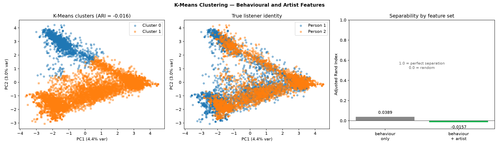

# Spotify Streaming Dashboard

An end-to-end machine learning pipeline over raw Spotify streaming history — engineered behavioral features, supervised preference classification, unsupervised listener clustering, and a similarity-based recommender — served through an interactive Plotly Dash app.

   

---

## Overview

Two people export their Spotify listening history. This project turns those raw JSON logs into a quantitative comparison of how they listen — and then asks a harder question: **can a model learn one person's taste well enough to pick songs for them out of someone else's library?**

The pipeline runs in four stages:

```
raw JSON  →  feature engineering  →  models  →  dashboard
             (dimensions.py)         (classifier, clustering,
                                       recommender)
```

---

## Machine Learning

### Feature engineering

Every user and every track is reduced to a set of normalized **behavioral probability vectors** ([`dimensions.py`](dimensions.py)):

| Vector | Dim | Captures |
|---|---|---|
| Hourly | 24 | Listening distribution across hour of day |
| Day of week | 7 | Weekday vs weekend rhythm |
| Seasonal | 4 | Winter / Spring / Summer / Fall |
| Listen duration | 6 | Bucketed play lengths (`<10s` → `3min+`) |
| Engagement | 3 | Skipped / partial / completed |
| Skip rate | 1 | Proportion of plays under 30s |
| Artist | sparse | Share of total minutes per artist |

Each vector is L1-normalized to a proportion, so users with wildly different total listening volume remain directly comparable.

### Similarity measure

[`similarity.py`](similarity.py) scores two listeners per dimension with cosine similarity, then combines them into a single weighted score. Weights renormalize over whichever dimensions are present, so the measure degrades gracefully on partial data.

### Supervised — would this listener return to this track?

[`classifier.py`](classifier.py) builds one row per unique `(track, artist)` pair. Features are **similarity scores between that track's listening pattern and the user's overall profile** — the model never sees the track's raw identity, only how well its behavioral signature matches the listener.

The history is split chronologically at 80%. Features are built from the earlier window; the label — *did the listener come back to this track?* — is taken from the later one. Two classifiers are compared: a depth-limited **decision tree** and **KNN (k=5)** inside a scaling pipeline.

### Unsupervised — are two listeners separable?

[`clustering.py`](clustering.py) clusters tracks from both listeners and scores the split against true identity. The two feature blocks are reduced separately, because they cannot share a preprocessing path: standardizing a sparse artist one-hot rescales every near-empty column up to unit variance, spreading variance evenly across all columns and leaving PCA nothing concentrated to find. The behavioral block is standardized; the artist indicator goes through **TruncatedSVD**, which does not center and so preserves the sparse structure. On the histories below this raised retained variance from 4.3% to 31.7%.

It runs twice — on behavior alone, and with artist identity added — and reports both.

Distance from each track to its assigned centroid doubles as an **outlier score**, surfacing the most behaviorally unusual tracks per listener.

### Recommender

[`recommender.py`](recommender.py) trains a model on one person's profile, then scores every track in the *other* person's library and ranks the predicted returns by `predict_proba` confidence.

---

## Methodology notes

Two decisions that are easy to get wrong, and how they're handled here:

**Label leakage, and why a random split could not fix it.** Spotify's export has no explicit ratings, so preference has to be inferred from implicit feedback. The obvious label — `played more than once` — leaks badly, and dropping the offending feature does not fix it.

The reason is structural: every feature is aggregated over a track's plays, so a label derived from *those same plays* bleeds into all of them at once through the group size. A raw skip count is bounded above by the play count, so `skip_count >= 2` implies the label outright. Subtler, a single-play track's hourly vector is a one-hot while a repeatedly-played track's is spread across hours — so even the cosine similarities encode play count. No random train/test split can separate them, because the leak is in the feature construction, not the row assignment.

The fix is to split on **time** rather than on rows. Features come from the first 80% of the history; the label — whether the listener returned to the track — comes from the held-out remainder. Features and label now derive from disjoint sets of plays, which closes both paths at once. Play count becomes a legitimate feature again, because a track's history is genuinely known at prediction time.

**Evaluation beyond accuracy.** Roughly three quarters of tracks are never returned to, so a model that predicts "no" every time already scores about 75%. Accuracy alone cannot tell you whether a model beat that. The pipeline reports:

- **Classification** — accuracy *against a `DummyClassifier` majority baseline*, ROC-AUC, PR-AUC against the positive rate, precision, recall, a confusion matrix, and 5-fold stratified cross-validated AUC with its standard deviation
- **Clustering** — Adjusted Rand Index against true listener identity, silhouette score, and per-cluster purity

Reporting the baseline alongside the score is the point: under the temporal split the decision tree's raw accuracy can land *below* the majority baseline while its AUC is clearly above chance — a model with real signal that a single accuracy figure would misrepresent in both directions.

**Scaling inside the pipeline.** KNN is distance-based, and `play_count` is an unbounded count while every similarity feature is bounded to `[0, 1]`. Unscaled, `play_count` alone would determine every neighbourhood. The `StandardScaler` sits *inside* a `Pipeline`, so it is refit on each cross-validation fold rather than on the full dataset — fitting it once up front would leak test-fold statistics into training.

Both are surfaced in the dashboard, not just printed, so the model's failure modes are visible alongside its successes.

---

## Results

Measured on the author's own export — 45,013 plays against a second listener's 14,522, over a shared window of March 2025 to March 2026. Numbers are specific to these two histories; the point is the protocol, not the values.

### Track return prediction

Predicting whether a listener comes back to a track in the held-out final 20% of their history:

| | Decision Tree | KNN (k=5) |
|---|---|---|
| Tracks | 5,062 | 3,236 |
| Return rate | 18.6% | 19.0% |
| **ROC-AUC** | **0.858** | **0.797** |
| 5-fold CV ROC-AUC | 0.851 ± 0.007 | 0.781 ± 0.035 |
| PR-AUC | 0.503 *(baseline 0.186)* | 0.540 *(baseline 0.190)* |
| Accuracy | 76.9% *(baseline 81.4%)* | 84.7% *(baseline 81.0%)* |
| Precision / Recall | 43.7% / 85.1% | 64.0% / 44.7% |

**The decision tree scores below the majority-class baseline on accuracy while reaching 0.858 ROC-AUC.** Reported alone, accuracy would call it worse than a model that always answers "no". It is in fact a strong ranker that `class_weight='balanced'` has pushed toward recall, catching 85% of the tracks actually returned to. PR-AUC nearly triples the positive rate, and the cross-validated spread of ±0.007 says the result is stable rather than a lucky split. This is the case the evaluation protocol exists to catch.

The two models divide the tradeoff: the tree finds almost everything at low precision, KNN is precise but recovers under half.

### Listener separability — a negative result

| Feature set | ARI | Silhouette |
|---|---|---|
| Behavior only | 0.0389 | 0.0769 |
| Behavior + artist | −0.0157 | 0.0451 |

Neither separates the two listeners (ARI 0 is random). That holds up under scrutiny rather than indicating a broken pipeline:

- **Behaviorally they are near-identical.** Day-of-week similarity is 0.989, hourly 0.881, engagement 0.934. There is little for a behavioral clustering to split on.
- **Artist identity cannot help in this encoding.** Their libraries genuinely differ — artist similarity is 0.040, with only 12% of the combined artist set shared. But a track's one-hot has a single 1, so any two tracks by different artists are orthogonal *whether or not they belong to the same listener*. The block encodes which artist a track belongs to and nothing about which listener that artist belongs to, leaving K-Means no co-occurrence structure to exploit. Recovering it would need an artist representation learned from co-listening, which cannot be built here without using the labels.



The left and middle panels are the result in one picture. K-Means does find two clean, well-separated clusters — it is not failing to converge. They simply have nothing to do with who was listening: colour the same points by true identity and both listeners are spread evenly across both clusters.

So: two people who listen to almost entirely different music, in almost exactly the same way.

---

## Dashboard

| Tab | Contents |
|---|---|
| 📊 Distribution | Histogram of track listening durations |
| 📈 Timeline | Daily listening time with 7-day rolling average |
| 🔥 Heatmap | Activity by hour of day vs day of week |
| 📦 Box Plots | Duration broken down by hour and weekday |
| 🎤 Artists / 🎵 Tracks | Ranked bar charts and word clouds sized by listening time |
| ⚡ Deep Dive | Parallel coordinates and an animated cumulative artist race |
| 🎵 Recommender | Live model switching (Decision Tree / KNN) with confidence-ranked picks and a confusion matrix |
| 🔬 Analytics | Similarity breakdown, PCA cluster projection, outlier tracks |

---

## Project Structure

```
├── app.py            # Dash entry point — server, recommender callbacks
├── main.py           # CLI entry point — runs the full analysis pipeline
│
├── ML / analysis
│   ├── dimensions.py   # Behavioral feature vectors (user- and track-level)
│   ├── similarity.py   # Cosine similarity + weighted scoring
│   ├── classifier.py   # Decision tree & KNN preference classifiers
│   ├── clustering.py   # PCA + K-Means, outlier detection, ARI/silhouette
│   ├── recommender.py  # Cross-library recommendation generation
│   └── analytics.py    # Precomputed similarity & clustering for the dashboard
│
├── data
│   ├── data_loader.py  # JSON loading, overlap-window alignment (CLI)
│   └── data.py         # Loading, derived columns, stats, word clouds (dashboard)
│
└── generate_sample_data.py   # Synthetic exports (dev fixture, see Development)
│
├── presentation
│   ├── charts.py       # Plotly figure builders
│   ├── layout.py       # Dash components and page layout
│   ├── config.py       # Theme constants and figure styling helpers
│   └── assets/style.css
```

---

## Getting Started

### 1. Get your data

Request your export from [Spotify Privacy Settings](https://www.spotify.com/account/privacy/). Place each person's `StreamingHistory_music_*.json` files in their own directory:

```
my_spotify_data/
├── StreamingHistory_music_0.json
└── StreamingHistory_music_1.json
atharva_more_spotify_data/
├── StreamingHistory_music_0.json
└── StreamingHistory_music_1.json
```

Both directories are gitignored — no listening history is committed to this repo. The exact filenames read are listed at the top of [`data.py`](data.py) and [`main.py`](main.py); adjust them to match how many files your export contains.

### 2. Install

```bash
python -m venv .venv && source .venv/bin/activate
pip install -r requirements.txt
```

### 3. Run

```bash
python app.py    # interactive dashboard -> http://127.0.0.1:8050
python main.py   # full analysis pipeline, printed to stdout
```

## Data Schema

Each record in a `StreamingHistory` file provides:

| Field | Description |
|---|---|
| `endTime` | Timestamp of when the track ended |
| `artistName` | Artist name |
| `trackName` | Track name |
| `msPlayed` | Milliseconds played |

Plays under 30 seconds are treated as skips throughout — Spotify's own threshold for counting a stream.

---

## Built With

- [scikit-learn](https://scikit-learn.org/) — Classification, clustering, PCA, metrics
- [pandas](https://pandas.pydata.org/) / [NumPy](https://numpy.org/) — Data processing and vector math
- [Dash](https://dash.plotly.com/) — Web framework for Python
- [Plotly](https://plotly.com/python/) — Interactive charting
- [Dash Bootstrap Components](https://dash-bootstrap-components.opensource.faculty.ai/) — UI components
- [WordCloud](https://github.com/amueller/word_cloud) — Word cloud generation

---

## Development

Spotify takes several days to fulfil a data export. [`generate_sample_data.py`](generate_sample_data.py) writes seeded synthetic exports into the same directories, so the pipeline can be exercised end to end in the meantime:

```bash
python generate_sample_data.py
```

This is a smoke-test fixture, not a demo. The synthetic data has no real relationship between a track's history and whether it is returned to later, so model scores on it sit near chance. It verifies that the code runs — not that the model works.
